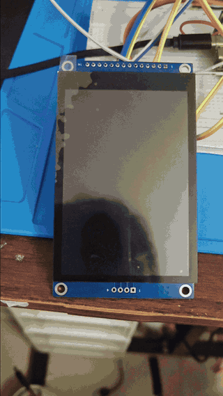
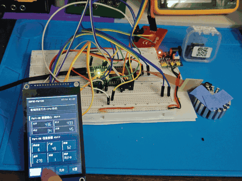
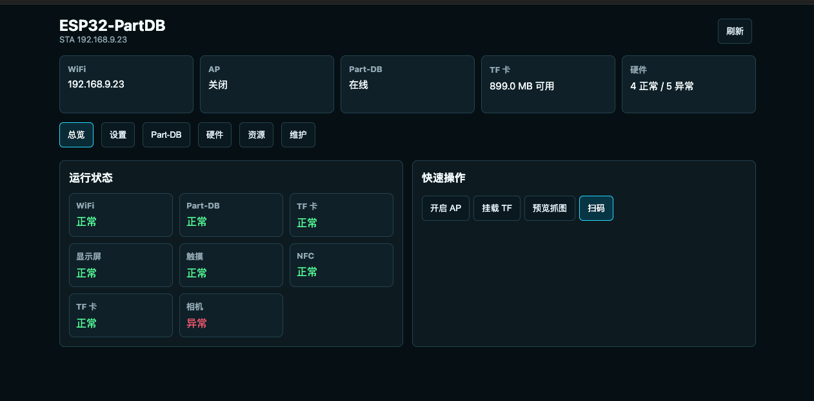
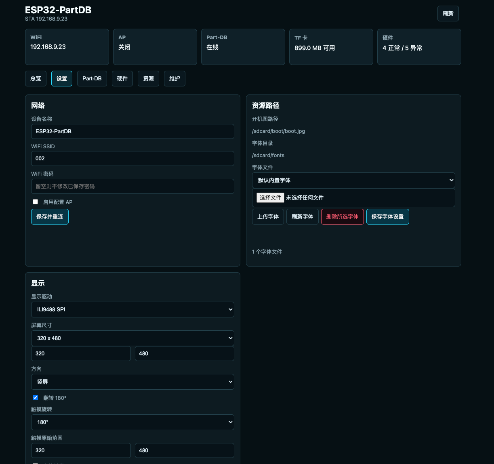
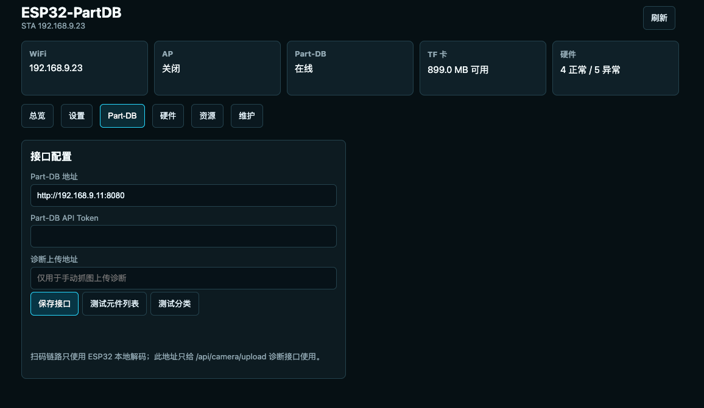
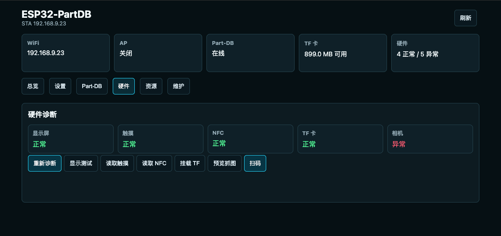
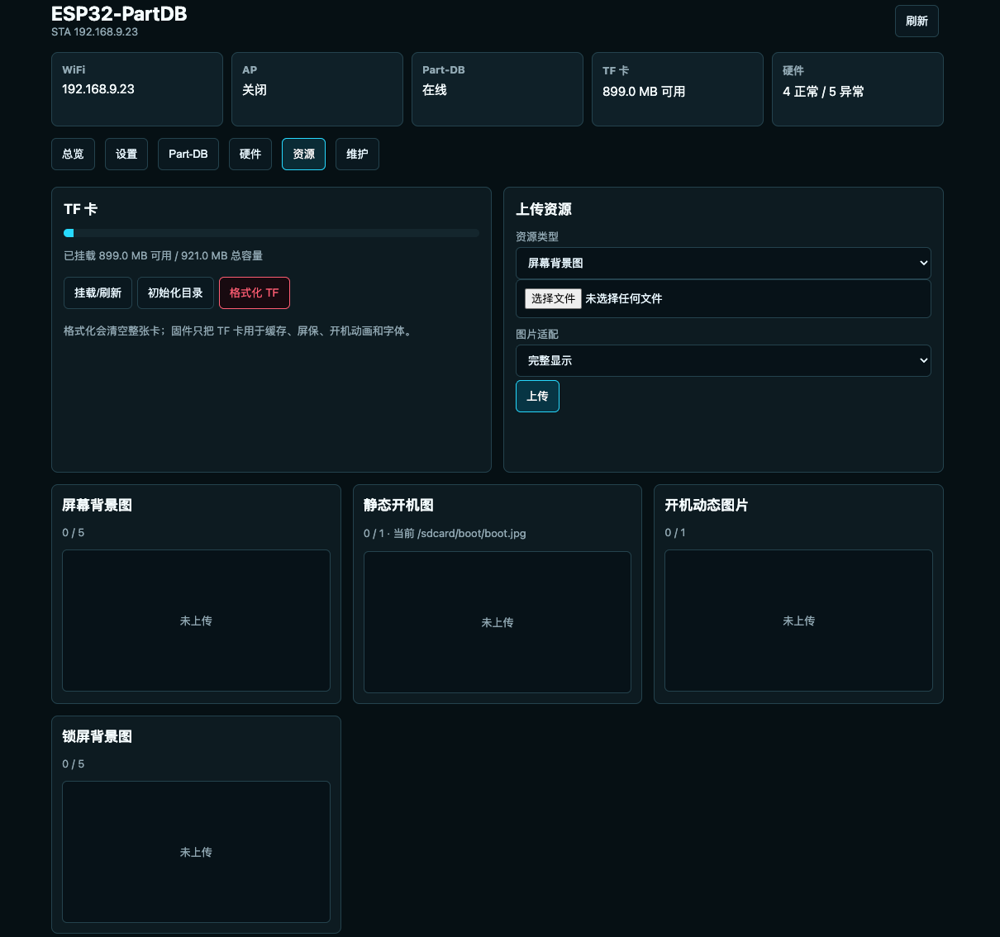
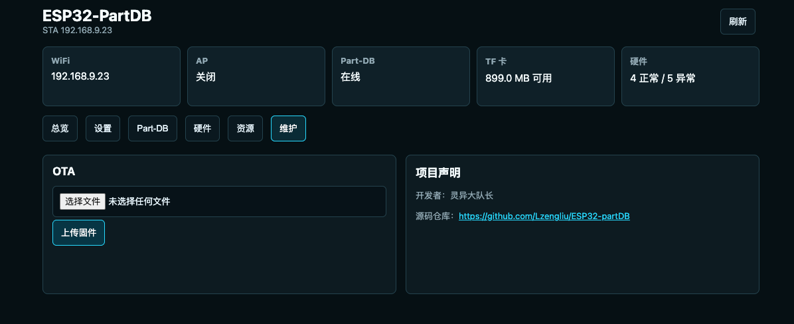

<h1 align='center'>ESP32-partDB</h1>

<p align='center'><strong>An ESP32-S3 touch terminal for Part-DB</strong></p>

<p align='center'>Part lookup · Stock operations · QR scanning · NFC tags · Local web management</p>

<p align='center'>
  
  
  
  
</p>

<p align='center'>
  <a href='README.md'><strong>Chinese Version</strong></a> ·
  <a href='https://github.com/Lzengliu/ESP32-partDB/releases/tag/v1.1'>V1.1 Release</a> ·
  <a href='docs/CHANGES_V1.0_TO_V1.1_EN.md'>V1.0 → V1.1 Changes</a>
</p>

ESP32-partDB is a standalone hardware terminal that runs on ESP32-S3; it is not the Part-DB server. It is designed for electronics workbenches and component storage areas, combining touch interaction, QR scanning, NFC, stock operations, resource management, and device diagnostics.

- Current stable release: **V1.1**
- Author: **灵异大队长**
- Source repository: https://github.com/Lzengliu/ESP32-partDB
- Part-DB upstream: https://github.com/Part-DB/Part-DB-server

## Feature Demos

### On-Device Experience

<table>
  <tr>
    <td width='50%' align='center'><strong>Screen Wake and Home</strong><br><sub>Automatic sleep, touch wake, and quick actions</sub></td>
    <td width='50%' align='center'><strong>Keyboard, Search, and Results</strong><br><sub>Touch input, result browsing, and detail navigation</sub></td>
  </tr>
  <tr>
    <td align='center' valign='top'></td>
    <td align='center' valign='top'></td>
  </tr>
  <tr>
    <td align='center'><strong>Camera QR Scanning</strong><br><sub>Local preview, manual focus, and QR decoding</sub></td>
    <td align='center'><strong>NFC Workflow</strong><br><sub>Background polling, NDEF, and Part-DB routing</sub></td>
  </tr>
  <tr>
    <td align='center' valign='top'></td>
    <td align='center' valign='top'></td>
  </tr>
</table>

### Web Management Interface

<table>
  <tr>
    <td width='50%' align='center'><strong>Overview</strong></td>
    <td width='50%' align='center'><strong>Device Settings</strong></td>
  </tr>
  <tr>
    <td valign='top'></td>
    <td valign='top'></td>
  </tr>
  <tr>
    <td align='center'><strong>Part-DB Connection</strong></td>
    <td align='center'><strong>Hardware Diagnostics</strong></td>
  </tr>
  <tr>
    <td valign='top'></td>
    <td valign='top'></td>
  </tr>
  <tr>
    <td align='center'><strong>TF Card and Resources</strong></td>
    <td align='center'><strong>Maintenance and OTA</strong></td>
  </tr>
  <tr>
    <td valign='top'></td>
    <td valign='top'></td>
  </tr>
</table>

> [!NOTE]
> The Camera status shown as abnormal in these screenshots is expected. To reduce resource use, the camera normally sleeps and releases its driver. Before Preview or Scan has woken and warmed up the sensor, a status check may report it as abnormal. Starting a preview or scan initializes and warms up the camera on demand.

## First Connection

On a fresh device or while WiFi is not configured, the terminal starts its default AP:

| AP name (SSID) | AP password | Web management URL |
| --- | --- | --- |
| `PartDB-Terminal` | `partdb1234` | `http://192.168.4.1/` |

1. Connect a computer or phone to `PartDB-Terminal`.
2. Open `http://192.168.4.1/` in a browser.
3. Configure WiFi, the Part-DB URL, the API token, and other device options.

## Core Capabilities

| Area | V1.1 capabilities |
| --- | --- |
| Part-DB | URL and API token configuration, fuzzy search, detail lookup, caching, stock updates, and Part/Lot/IPN/barcode routing |
| Device UI | Home, Search Results, Detail, Shortcuts, Info, Settings, touch keyboard, brightness, and automatic sleep |
| QR | Local ESP32 decoding with ZXing-C++ first and quirc fallback, SVGA grayscale frames, and conditional retry |
| NFC | PN532 background polling, NDEF text read/write/clear, and Part-DB content routing |
| TF resources | File, background, boot image, lock image, and font resource management |
| Web and maintenance | Configuration, status, hardware diagnostics, camera preview, scanning, TF management, and OTA |
| Reliability | 8 MB PSRAM, HTTP concurrency protection, OTA rollback confirmation, failed-upload cleanup, and a persistent device secret |

See [Feature Details](docs/FEATURES_EN.md) and [Known Issues](docs/KNOWN_ISSUES_EN.md).

## Main Hardware

- ESP32-S3 with 16 MB flash and 8 MB Octal PSRAM
- ILI9488 SPI display and FT6336 touch controller
- PN532 NFC module on a dedicated hardware I2C bus
- SDMMC 1-bit TF card
- ESP32-S3 camera with manual optical focus

See [firmware/docs/wiring-and-bringup.md](firmware/docs/wiring-and-bringup.md) for detailed wiring.

## Build

The verified toolchain is **ESP-IDF v5.5.2**:

```sh
cd firmware
idf.py set-target esp32s3
idf.py build
idf.py merge-bin
```

The first build downloads the locked `esp32-camera`, `esp_jpeg`, and `quirc` managed components. The trimmed ZXing-C++ source is vendored under `third_party/zxing-cpp/`.

## Upgrading from V1.0

> [!IMPORTANT]
> V1.1 changes the partition table. The first upgrade from V1.0 must write the complete merged image at `0x0`. Do not upload the V1.1 OTA application image through the V1.0 web page.

```sh
python -m esptool --chip esp32s3 -b 460800 \
  --before default_reset --after hard_reset write_flash \
  0x0 esp32_partdb_terminal_v1.1_merged.bin
```

After the V1.1 partition layout is installed, later versions with the same layout can be updated through web OTA.

## Release Files

| File | Purpose |
| --- | --- |
| `esp32_partdb_terminal_v1.1_merged.bin` | Complete first flash or partition-layout upgrade; write at `0x0` |
| `esp32_partdb_terminal_v1.1_ota.bin` | Web OTA application image for the same partition layout |
| `esp32_partdb_terminal_v1.1_firmware.zip` | Bootloader, partition table, OTA data, application, and flashing documentation |
| `esp32_partdb_terminal_v1.1_source.zip` | Cleaned public source with Chinese and English documentation |
| `SHA256SUMS` | SHA-256 checksums for release assets |

See the [V1.1 Release Notes](docs/RELEASE_V1.1_EN.md) for flashing and validation details.

## Documentation

- [V1.1 Feature Details](docs/FEATURES_EN.md)
- [V1.1 Known Issues](docs/KNOWN_ISSUES_EN.md)
- [V1.0 → V1.1 Changes](docs/CHANGES_V1.0_TO_V1.1_EN.md)
- [V1.1 Release and Flashing Guide](docs/RELEASE_V1.1_EN.md)
- [Firmware Project Guide](firmware/README.md)
- [Third-Party Code and Licenses](docs/THIRD_PARTY_CODE.md)

## License

Project-owned code is released by 灵异大队长 under the Apache License 2.0. Third-party components and generated font data retain their original licenses. See [NOTICE.md](NOTICE.md) and [Third-Party Code](docs/THIRD_PARTY_CODE.md).
